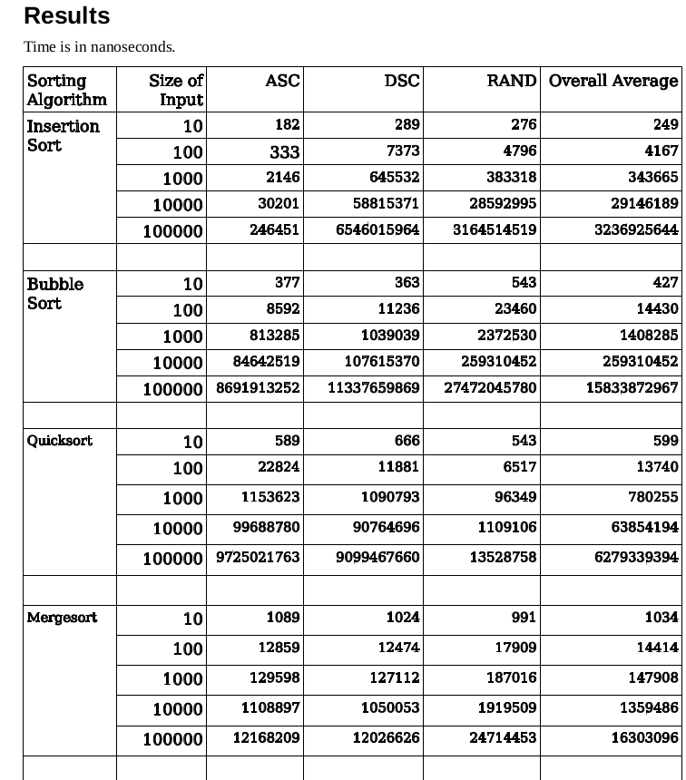

# Sorting-Algorithm-Comparison

**Introduction**

A normal computer science engineering student, like me, has to study sorting
algorithms three times in his graduation. The first time in the first year in
Introduction to programming course, the second time in the second year in the
Data Structures course and third time in the third year in Analysis of Algorithms
course. But every year students study sorting algorithms from new perspective.
There are several reasons for this :

• Sorting is the fundamental building block of many computer algorithms.

• Computers have historically spent more time sorting than doing anything
else. One-fourth of all mainframe cycles were spent sorting data [Knu98].

• Most interesting ideas in algorithms design had come from sorting
algorithms.

• There are at least a dozen sorting algorithms each has its unique
properties.

we will compare the running time of Insertion Sort, Bubble Sort,
Quicksort, Mergesort.

**Approach used for comparison**

I have selected four sorting algorithms mentioned above. Sorting algorithms will
be executed on different size inputs. Sizes of input are 10,100, 1000,10000,
100000. Input will be an array of integers.
Every input has three cases, the first Input is already sorted in ascending order,
the second input is already sorted in descending order and the third input is in
random order. Each algorithm will sort input array in ascending order. Each
input case sorting algorithm is executed four times and the running time of the
algorithm is recorded in nanoseconds.

**Technical specifications of System**

Algorithm Implementation Language - GO

Compiler Version - go1.10.4 Linux/amd64Operating System - Ubuntu 19.09

OS Type - 64-bit

Processor - Intel® CoreTM i3-6006U CPU @ 2.00GHz × 4

